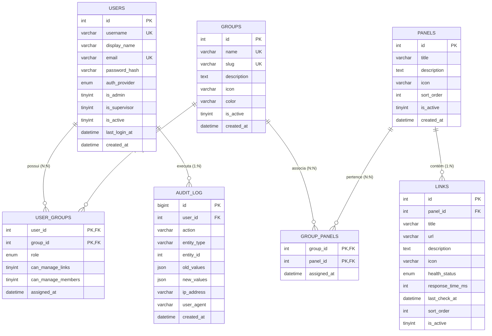

# 📘 Documentação Técnica Oficial — Omniflowti v2.0
## Portal Unificado Corporativo Flowti

---

## 📑 Sumário
1. [Visão Geral e Objetivos](#1-visão-geral-e-objetivos)
2. [Arquitetura Geral do Sistema](#2-arquitetura-geral-do-sistema)
3. [Camada Frontend (SPA)](#3-camada-frontend-spa)
4. [Camada Backend (PHP 8.2+ Clean Architecture)](#4-camada-backend-php-82-clean-architecture)
5. [Contrato e Endpoints da API REST](#5-contrato-e-endpoints-da-api-rest)
6. [Modelagem do Banco de Dados (MySQL 8.0)](#6-modelagem-do-banco-de-dados-mysql-80)
7. [Autenticação e Controle de Acesso (RBAC N:N)](#7-autenticação-e-controle-de-acesso-rbac-nn)
8. [Engine de Health Check Assíncrono](#8-engine-de-health-check-assíncrono)
9. [Infraestrutura, Docker e CI/CD](#9-infraestrutura-docker-e-cicd)
10. [Guia de Configuração e Execução Local](#10-guia-de-configuração-e-execução-local)
11. [Garantia de Qualidade e Testes (QA)](#11-garantia-de-qualidade-e-testes-qa)
12. [Governança de Mudanças Técnicas (RMTs)](#12-governança-de-mudanças-técnicas-rmts)

---

## 1. 🎯 Visão Geral e Objetivos

O **Omniflowti** é o portal corporativo unificado desenvolvido para centralizar todos os links, sistemas internos, ferramentas de observabilidade e consoles em nuvem da organização em um ponto único de acesso seguro, rápido e responsivo.

### Principais Diretrizes:
- **Zero Complexidade Desnecessária**: Construído sem frameworks pesados ou processos de build demorados.
- **Alta Resiliência e Desempenho**: Backend PHP 8.2 puro com tipagem estrita e Frontend Vanilla JS extremamente veloz.
- **Design System Moderno**: Tema **Aura Electric Dark** com estética **Glassmorphism**, tipografia de ponta (*Space Grotesk* e *Inter*) e suporte a múltiplos temas corporativos escuros.
- **Segurança Corporativa**: Autenticação híbrida conectada ao **Active Directory (LDAP)** com fallback local, auditoria de ações e modelo de autorização **RBAC N:N**.

---

## 2. 🏛️ Arquitetura Geral do Sistema

O sistema segue os preceitos de **Clean Architecture** e **Ports & Adapters**, garantindo desacoplamento estrito entre o cliente web, as regras de negócio e a persistência de dados.

```
                               ┌─────────────────────────────────────────┐
                               │       Frontend SPA (Vanilla JS)         │
                               │  Hash Router • State Store • Components │
                               │  Glassmorphism • Space Grotesk • Inter  │
                               └────────────────────┬────────────────────┘
                                                    │ Requisições HTTP (JSON / Multipart)
                               ┌────────────────────▼────────────────────┐
                               │         Router & Middleware             │
                               │  CORS • AuthSession • Admin/Supervisor  │
                               └────────────────────┬────────────────────┘
                                                    │
                               ┌────────────────────▼────────────────────┐
                               │           Controllers Layer             │
                               │ Auth, User, Group, Panel, Link, Health  │
                               └────────────────────┬────────────────────┘
                                                    │
                               ┌────────────────────▼────────────────────┐
                               │            Services Layer               │
                               │ Orquestração de Negócio & Strategies    │
                               └────────────────────┬────────────────────┘
                                                    │
                               ┌────────────────────▼────────────────────┐
                               │          Repositories Layer             │
                               │   Abstração de Acesso a Dados (PDO)     │
                               └────────────────────┬────────────────────┘
                                                    │
                               ┌────────────────────▼────────────────────┐
                               │       MySQL 8.0 (utf8mb4_unicode_ci)    │
                               │  Users • Groups • Panels • Links • Logs │
                               └─────────────────────────────────────────┘
```

---

## 3. 🎨 Camada Frontend (SPA)

O frontend é uma Single Page Application (SPA) construída com **Vanilla JavaScript (ES6+)**, sem frameworks (como React ou Vue), eliminando a necessidade de transpilação (Webpack/Vite) e garantindo carregamento instantâneo no navegador.

### 3.1. Estrutura de Arquivos Frontend
- `aplicação/public/index.html`: Shell principal HTML5 com importação de fontes do Google Fonts (*Space Grotesk*, *Inter*) e estilos.
- `aplicação/public/assets/css/app.css`: Folha de estilos central contendo o design system, variáveis CSS para os 9 temas, efeitos de jateamento (*glassmorphism*) e responsividade.
- `aplicação/public/assets/js/router.js`: Roteador cliente baseado no evento `hashchange` com suporte a rotas estáticas e dinâmicas (`#/panels/:id`).
- `aplicação/public/assets/js/state.js`: Store reativa de estado global (dados do usuário logado, painéis ativos, tema atual, estado de loading).
- `aplicação/public/assets/js/api.js`: Camada cliente de comunicação HTTP encapsulando `fetch()`, inclusão automática de credenciais de sessão e tratamento de erros.

### 3.2. Componentes Modulares (`aplicação/public/assets/js/components/`)
- `Topbar.js`: Cabeçalho corporativo com logo, saudação, busca global, seletor de temas e menu de perfil/logout.
- `Sidebar.js`: Barra lateral de navegação com atalhos para Dashboard, Catálogo de Painéis, Administração e atalho interativo da logo Flowti.
- `Dashboard.js`: Visão geral com métricas executivas (uptime geral, links ativos, contagem de painéis) e grade rápida de aplicações.
- `PanelManager.js`: Gestão de painéis, suporte à visão em Cartões (Tiles) ou Tabela, e navegação para a página exclusiva de cada setor.
- `GroupManager.js`: Gestão de setores/grupos e controle de permissões N:N de membros.
- `UserManager.js`: Cadastro, edição e importação em lote de colaboradores (exclusivo Admin).
- `LoginForm.js`: Tela de autenticação cyber-futurista com boot sequence a laser, logotipo Flowti Hub com badge HUB em neon pulsante, transição deslizante 2D para solicitação de acesso Active Directory e success veil animado.
- `ThemeManager.js`: Alternador em tempo real entre os 9 temas dark disponíveis (persistência em `localStorage`).
- `Modal.js` e `Toast.js`: Primitivas de interface para feedback visual imediato e diálogos modais acessíveis.

### 3.3. Paleta de Temas Suportados
Todos os temas são focados em ambientes escuros corporativos (NOC, SOC e Operações):
1. **Aura Electric Dark** (Padrão): Fundo preto profundo (`#0B0A0A`) com neon violeta elétrico (`#AB17EE`) e glassmorphism translúcido.
2. **Electric Ultramarine & Aqua**: Navy cibernético com ciano vibrante.
3. **Dark Mode Tech Neon**: Preto fosco (`#121212`) com roxo e verde neon.
4. **Safira Night**: Tons ardósia com azul safira e âmbar solar.
5. **Terracota Solar**: Gradiente quente corporativo de terracota coral e laranja.
6. **Flowti Observability**: Ciano de telemetria e coral de alerta.
7. **MV Saúde & Tecnologia**: Verde esmeralda e azul petróleo institucional.
8. **MV Azul Petróleo**: Visual sóbrio e clássico corporativo.
9. **Midnight Observability**: Preto OLED absoluto (`#000000`) para monitores de centros de controle.

---

## 4. ⚙️ Camada Backend (PHP 8.2+ Clean Architecture)

O backend é estruturado em PHP 8.2+ com tipagem forte (`declare(strict_types=1);`), respeitando os padrões PSR-4 para autoload e PSR-12 para estilo de código.

### 4.1. Camadas da Aplicação (`aplicação/src/`)
- **`Config/`**:
  - `Env.php`: Leitor de variáveis de ambiente com validação de tipagem e defaults.
  - `Database.php`: Singleton de conexão PDO MySQL com atributos de prepared statements estritos e emulação desabilitada.
  - `Ldap.php`: Configuração dos parâmetros de conexão com Active Directory/LDAP.
- **`Middleware/`**:
  - `CorsMiddleware.php`: Tratamento de requisições cross-origin e pre-flight `OPTIONS`.
  - `AuthMiddleware.php`: Verificação obrigatória de sessão ativa para rotas autenticadas.
  - `AdminMiddleware.php`: Bloqueio estrito de acesso para usuários que não possuam `is_admin = 1`.
  - `SupervisorMiddleware.php`: Autorização para usuários com privilégios de supervisor ou administrador.
- **`Repositories/`**:
  - Responsáveis exclusivos por executar queries SQL via PDO prepared statements:
  - `UserRepository.php`, `GroupRepository.php`, `PanelRepository.php`, `LinkRepository.php`, `AuditLogRepository.php`.
- **`Services/`**:
  - Concentram toda a lógica de negócio, transações, validações de regra e auditoria:
  - `AuthService.php`: Orquestra estratégias de autenticação e sessão.
  - `LocalAuthStrategy.php`: Autenticação via hash seguro `password_hash()` / `password_verify()`.
  - `LdapAuthStrategy.php`: Autenticação via protocolo LDAP com provisionamento automático no primeiro acesso.
  - `UserService.php`, `GroupService.php`, `PanelService.php`, `LinkService.php`.
  - `HealthCheckService.php`: Monitor assíncrono de disponibilidade de rede.
- **`Controllers/`**:
  - Recebem requisições HTTP, extraem e validam payloads via `Validator.php` e retornam respostas padronizadas via `Response.php`:
  - `AuthController`, `UserController`, `GroupController`, `PanelController`, `LinkController`, `HealthController`.
- **`Helpers/`**:
  - `Response.php`: Métodos utilitários `json()`, `error()`, `unauthorized()`, `notFound()`.
  - `Validator.php`: Validador de esquemas de dados (campos obrigatórios, e-mail, URLs válidas, tamanho de strings).

---

## 5. 🔌 Contrato e Endpoints da API REST

Todas as respostas da API seguem o envelope padrão JSON:
```json
{
  "status": "success | error",
  "data": { ... } | [ ... ] | null,
  "message": "Mensagem descritiva da operação",
  "errors": [ ... ]
}
```

### 5.1. Matriz de Endpoints

| Método | Endpoint | Middleware / Acesso | Descrição |
|:---|:---|:---|:---|
| `POST` | `/api/auth/login` | Público | Autenticação do usuário (Local ou LDAP) |
| `POST` | `/api/auth/request` | Público | Solicitação de acesso Active Directory (gravado em audit_log) |
| `POST` | `/api/auth/logout` | Autenticado | Encerramento da sessão ativa |
| `GET` | `/api/auth/me` | Autenticado | Retorna dados e permissões do usuário logado |
| `GET` | `/api/users` | Admin | Lista todos os usuários cadastrados |
| `POST` | `/api/users` | Admin | Cadastra novo usuário local |
| `POST` | `/api/users/import-csv` | Admin | Importa múltiplos usuários via arquivo `.csv` |
| `GET` | `/api/users/{id}` | Admin | Exibe detalhes de um usuário específico |
| `PUT` | `/api/users/{id}` | Admin | Atualiza dados cadastrais e permissões |
| `DELETE` | `/api/users/{id}` | Admin | Inativa ou remove usuário |
| `GET` | `/api/groups` | Autenticado | Lista todos os grupos/setores ativos |
| `POST` | `/api/groups` | Admin / Supervisor | Cria novo setor |
| `GET` | `/api/groups/{id}` | Autenticado | Detalhes de um grupo específico |
| `PUT` | `/api/groups/{id}` | Admin / Supervisor | Atualiza propriedades do grupo |
| `DELETE` | `/api/groups/{id}` | Admin | Remove grupo |
| `GET` | `/api/groups/{id}/members` | Autenticado | Lista integrantes do grupo com papéis |
| `PUT` | `/api/groups/{id}/members/{userId}` | Admin / Supervisor | Atribui papel e permissões granulares ao membro |
| `DELETE` | `/api/groups/{id}/members/{userId}`| Admin / Supervisor | Remove membro do grupo |
| `GET` | `/api/panels` | Autenticado | Lista painéis acessíveis pelo usuário |
| `POST` | `/api/panels` | Admin / Supervisor | Cria novo painel |
| `GET` | `/api/panels/{id}` | Autenticado | Retorna painel e links associados |
| `PUT` | `/api/panels/{id}` | Admin / Supervisor | Atualiza metadados do painel |
| `DELETE` | `/api/panels/{id}` | Admin | Remove painel |
| `GET` | `/api/links` | Autenticado | Lista todos os links liberados para o usuário |
| `POST` | `/api/links` | Gestor de Links | Cria um novo link |
| `POST` | `/api/links/import-csv` | Gestor de Links | Importação em lote de links via `.csv` com autodetecção de delimitador |
| `PUT` | `/api/links/{id}` | Gestor de Links | Edita link |
| `DELETE` | `/api/links/{id}` | Gestor de Links | Remove link |
| `POST` | `/api/health/check` | Autenticado | Dispara verificação assíncrona de status e latência |
| `GET` | `/api/dashboard/stats` | Autenticado | Retorna estatísticas de uptime, contadores e saúde da infra |

---

## 6. 🗄️ Modelagem do Banco de Dados (MySQL 8.0)

O banco de dados utiliza o charset `utf8mb4` com collation `utf8mb4_unicode_ci` e motor **InnoDB**.

### 6.1. Diagrama de Relacionamentos Entidade-Relacionamento (DER)



### 6.2. Dicionário das Tabelas Principais
1. **`users`**: Cadastro de identidades locais e replicadas do AD. O campo `password_hash` é nulo para contas puramente gerenciadas pelo Active Directory.
2. **`groups`**: Setores corporativos (ex.: NOC, DevOps, Suporte, Diretoria).
3. **`user_groups`**: Associação N:N entre usuários e setores, contendo as flags de autorização refinada `can_manage_links` e `can_manage_members`.
4. **`panels`**: Módulos que agrupam links com ordenação customizada (`sort_order`).
5. **`group_panels`**: Regra de visibilidade N:N que determina quais setores têm permissão de visualizar determinado painel.
6. **`links`**: Registro de sistemas e URLs corporativas com cache de métricas de saúde (`health_status`, `response_time_ms`).
7. **`audit_log`**: Trilha de conformidade obrigatória com payloads em formato `JSON` (`old_values` e `new_values`) para auditoria de segurança.

---

## 7. 🔐 Autenticação e Controle de Acesso (RBAC N:N)

### 7.1. Fluxo de Autenticação Híbrida
1. O usuário submete credenciais na tela de login (`/api/auth/login`).
2. Se `auth_provider == 'ldap'`, o sistema contacta o Active Directory via `LdapAuthStrategy`:
   - Em caso de primeiro acesso bem-sucedido no AD, o usuário é **auto-provisionado** na tabela `users`.
3. Se `auth_provider == 'local'`, as credenciais são validadas contra o `password_hash` gravado no banco local.
4. Após o sucesso, uma sessão segura via cookie HTTP-Only é estabelecida no servidor.

### 7.2. Hierarquia de Permissões (RBAC)
- **Administrador Global (`is_admin = 1`)**:
  - Acesso total a todas as rotas administrativas, gestão de usuários, criação de grupos, gestão global de painéis e logs de auditoria.
- **Supervisor (`is_supervisor = 1` ou role `supervisor` em grupo)**:
  - Gestão de membros do seu respectivo grupo e aprovação de links do seu setor.
- **Gestor de Links (`can_manage_links = 1`)**:
  - Permissão concedida a nível de grupo para adicionar, editar, remover e importar links `.csv` para os painéis atribuídos àquele grupo.
- **Colaborador Padrão (`member`)**:
  - Permissão de apenas leitura dos painéis e links liberados para os grupos aos quais pertence.

---

## 8. ❤️ Engine de Health Check Assíncrono

O monitoramento de status das aplicações cadastradas (`HealthCheckService`) utiliza **multi-cURL** assíncrono em PHP para verificar dezenas de URLs concorrentemente sem causar travamento ou latência na interface do usuário.

### Critérios de Status:
- 🟢 **Online**: Código HTTP 2xx ou 3xx e tempo de resposta inferior a 1500ms.
- 🟡 **Warning**: Código HTTP 2xx/3xx porém com alta latência (> 1500ms e < 3000ms), ou códigos de redirecionamento que exigem atenção.
- 🔴 **Offline**: Falha de resolução DNS, conexão recusada, timeout (> 3000ms) ou códigos HTTP 4xx / 5xx.
- ⚪ **Unknown**: Link recém-cadastrado que ainda não passou por verificação.

---

## 9. 🐳 Infraestrutura, Docker e CI/CD

### 9.1. Topologia de Containers (`docker/docker-compose.yml`)
- **`flowti-app`**:
  - Imagem construída a partir do `docker/Dockerfile` (PHP 8.2 Apache).
  - Extensões instaladas e compiladas: `pdo_mysql`, `curl`, `ldap`, `mbstring`.
  - Módulo `mod_rewrite` do Apache habilitado para tratamento de URLs amigáveis.
  - Porta exposta: `8080` (HTTP).
- **`flowti-mysql`**:
  - Imagem oficial `mysql:8.0`.
  - Inicialização automática com os scripts `database/schema.sql` e `database/seed.sql` mapeados em `/docker-entrypoint-initdb.d/`.
  - Health check nativo via `mysqladmin ping`.
  - Porta exposta: `3306`.
- **`flowti-phpmyadmin`**:
  - Console visual para administração do MySQL em ambiente de desenvolvimento.
  - Porta exposta: `8081`.

### 9.2. Automação e Pipeline Guardian
No diretório `scripts/`, o projeto conta com:
- `pipeline-guardian.sh` e `pipeline-guardian.py`: Utilitários automatizados de validação estática de código, execução de testes e verificação de integridade antes do envio de commits.

---

## 10. 🚀 Guia de Configuração e Execução Local

### 10.1. Pré-requisitos
- Docker Engine 24.0+ e Docker Compose v2.
- Permissão de acesso ao Docker socket (veja nota abaixo caso encontre erro de permissão).

> [!TIP]
> **Correção de Permissão no Docker no Linux**:  
> Se o comando `docker compose` apresentar o erro `permission denied while trying to connect to the docker API at unix:///var/run/docker.sock`, execute em seu terminal:
> ```bash
> sudo usermod -aG docker $USER
> newgrp docker
> ```
> Isso adiciona seu usuário ao grupo do Docker sem necessidade de usar `sudo` repetidamente.

### 10.2. Passo a Passo de Execução

1. **Configurar variáveis de ambiente**:
   ```bash
   cp aplicação/.env.example aplicação/.env
   ```
2. **Subir os containers**:
   ```bash
   cd docker
   docker compose up -d --build
   ```
3. **Verificar os containers em execução**:
   ```bash
   docker compose ps
   ```
4. **Acessar os portais**:
   - **Portal Omniflowti**: [http://localhost:8080](http://localhost:8080)
   - **phpMyAdmin**: [http://localhost:8081](http://localhost:8081)

### 10.3. Credenciais Padrão de Inicialização (Seed)
As credenciais de teste para desenvolvimento estão provisionadas no arquivo de seed inicial:
- **Administrador**: `admin` / `Admin@Flowti2026`
- **Supervisor**: `suporte` / `Suporte@Flowti2026`
- **Usuário Padrão**: `usuario` / `User@Flowti2026`

---

## 11. 🧪 Garantia de Qualidade e Testes (QA)

A suíte de testes do projeto garante a estabilidade de contratos de API e regras de validação.

### 11.1. Testes Unitários de Helpers (PHPUnit)
Localizados em `aplicação/tests/Unit/ValidatorTest.php`:
```bash
docker exec -it flowti-app vendor/bin/phpunit
```

### 11.2. Suíte de Testes Automatizados de Integração (API QA)
Localizada em `aplicação/tests/api_test.php`:
- Executa **52 cenários de teste automatizados** cobrindo autenticação, controle de permissões por perfil, CRUD de links e painéis, importação CSV e monitoramento de integridade.
```bash
docker exec -it flowti-app php tests/api_test.php
```

---

## 12. 📜 Governança de Mudanças Técnicas (RMTs)

Para manter a rastreabilidade e a transparência de toda a evolução técnica do projeto:

> [!IMPORTANT]
> **Toda e qualquer alteração técnica realizada no código, banco de dados, infraestrutura ou arquitetura DEVE gerar um novo arquivo de registro em [`Documentações/modificacoes-tecnicas/`](modificacoes-tecnicas/)**.

- **Nomenclatura do arquivo**: `RMT-YYYYMMDD-XX-nome-da-mudanca.md`
- **Modelo obrigatório**: Seguir o padrão definido em [`Documentações/modificacoes-tecnicas/TEMPLATE-RMT.md`](modificacoes-tecnicas/TEMPLATE-RMT.md).
- **Atualização do índice**: Incluir a referência da nova mudança no arquivo [`Documentações/modificacoes-tecnicas/README.md`](modificacoes-tecnicas/README.md).
