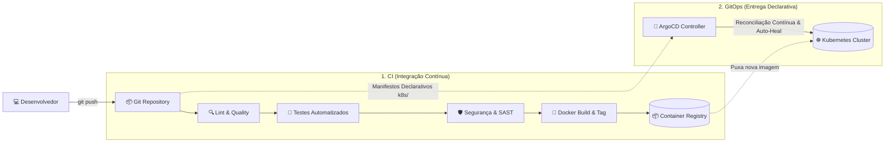

# 📘 Guia Definitivo: GitOps com ArgoCD e Pipelines CI/CD Universais Replicáveis

Este guia consolida o aprendizado prático, a solução do diagnóstico do ArgoCD e a arquitetura de **esteira CI/CD universal** projetada para ser replicada em qualquer nova aplicação do ecossistema com o mínimo de alteração possível.

---

## 🧭 Índice
1. [Por que a aplicação não aparecia no ArgoCD? (Diagnóstico & Solução)](#1-por-que-a-aplicação-não-aparecia-no-argocd)
2. [Como acessar o Dashboard Web do ArgoCD](#2-como-acessar-o-dashboard-web-do-argocd)
3. [Conceito Fundamental: Como Funciona o GitOps (CI vs. CD)](#3-conceito-fundamental-como-funciona-o-gitops)
4. [A Pipeline Universal Reutilizável](#4-a-pipeline-universal-reutilizável)
5. [Passo a Passo: Replicando para uma Nova Aplicação em 3 Minutos](#5-passo-a-passo-replicando-para-uma-nova-aplicação)
6. [Automação com o Script de Onboarding](#6-automação-com-o-script-de-onboarding)

---

## 1. Por que a aplicação não aparecia no ArgoCD?

No Kubernetes com GitOps, o **ArgoCD não descobre aplicações automaticamente apenas porque os pods estão rodando no cluster**. Ele é um controlador declarativo que exige um manifesto do tipo **`Application`** (`kind: Application` na API `argoproj.io/v1alpha1`).

Durante o diagnóstico, identificamos dois fatores exatos:
1. **O manifesto `Application` estava desatualizado em relação ao Git remoto:**
   O arquivo `argocd/application.yaml` apontava para `path: k8s` no repositório `https://github.com/JairoJSilva/intranet.git`. Como a pasta `k8s/` havia sido criada localmente e ainda não estava sincronizada na branch `main` do GitHub remoto, o ArgoCD reportava o erro:
   ```text
   ComparisonError: failed to generate manifest: k8s: app path does not exist
   ```
2. **Falta de Ingress para acesso ao painel do ArgoCD:**
   O serviço `argocd-server` estava isolado internamente no namespace `argocd` sem rota Ingress exposta no host.

### ✅ O que foi corrigido:
- A branch `main` no GitHub foi sincronizada com a pasta `k8s/`.
- Executamos um *Hard Refresh* na aplicação do ArgoCD:
  ```bash
  kubectl annotate application portal-intranet -n argocd argocd.argoproj.io/refresh=hard --overwrite
  ```
- O ArgoCD leu a árvore de Kustomize e sincronizou todos os **16 recursos**:
  - `Namespace/intranet`
  - `Deployment/intranet-app`, `Deployment/mysql`, `Deployment/pipeline-guardian`
  - `Service/intranet-service`, `Service/mysql`, `Service/pipeline-guardian-service`
  - `ConfigMap/intranet-config`, `ConfigMap/mysql-initdb`
  - `Secret/intranet-secret`, `Secret/mysql-secret`
  - `PersistentVolumeClaim/mysql-pvc`
  - `Ingress/intranet-ingress`
  - `ServiceAccount`, `Role` e `RoleBinding` do Pipeline Guardian
- Status atual no cluster: **Synced | Healthy (100% verde)**.

---

## 2. Como acessar o Dashboard Web do ArgoCD

Configuramos o Ingress NGINX para expor o painel web diretamente no seu navegador local:

- 🌐 **URL de Acesso:** [http://argocd.local](http://argocd.local)
- 👤 **Usuário:** `admin`
- 🔑 **Senha Inicial:** `uXlxrn2LLOmPlcpf`

> [!TIP]
> Caso queira alterar a senha do admin no futuro:
> ```bash
> argocd account update-password --account admin --current-password uXlxrn2LLOmPlcpf --new-password <NovaSenha>
> ```
> Ou via CLI com port-forward direto:
> ```bash
> kubectl port-forward svc/argocd-server -n argocd 8080:80
> ```

---

## 3. Conceito Fundamental: Como Funciona o GitOps?

Tradicionalmente (CI/CD antigo), o pipeline de CI tinha permissões de administrador no cluster e executava `kubectl apply` diretamente. Isso gerava falhas de segurança, drift manual e ausência de histórico de versão do que realmente estava rodando em produção.

No modelo **GitOps**:


### Regras de Ouro do GitOps:
1. **O Git é a Única Fonte da Verdade**: Se não está no Git, não existe no cluster.
2. **Self-Healing Automático**: Se alguém apagar um pod ou alterar uma réplica manualmente via terminal, o ArgoCD detecta a divergência (*drift*) e restaura o estado definido no Git em segundos (`selfHeal: true`).
3. **Prune Automático**: Se você deletar um manifesto no Git, o ArgoCD remove o recurso correspondente do Kubernetes sem deixar lixo órfão (`prune: true`).

---

## 4. A Pipeline Universal Reutilizável

Para evitar reescrever dezenas de linhas de YAML para cada nova aplicação, criamos o template universal em [`ci-templates/universal-pipeline.gitlab-ci.yml`](file:///home/jairo/Documentos/intranet/ci-templates/universal-pipeline.gitlab-ci.yml).

### Estrutura dos 5 Estágios Padrão:
1. `lint-and-quality`: Valida a sintaxe da linguagem (`php`, `nodejs`, `python`, `go`) e valida os manifestos Kubernetes via `kustomize build` ou `kubectl dry-run`.
2. `security-sast`: Varredura estática de segurança e bloqueio de commits com chaves de API, senhas ou tokens hardcoded.
3. `test`: Executa os testes unitários e de integração da aplicação.
4. `build-image`: Compila a imagem Docker multi-stage, gera tags semânticas baseadas em SemVer ou Git SHA, e faz push para o Container Registry.
5. `gitops-sync`: Notifica o ArgoCD para sincronizar imediatamente a nova versão.

---

## 5. Passo a Passo: Replicando para uma Nova Aplicação

Quando você for criar qualquer novo microsserviço ou aplicação (ex: `financeiro-api`), você só precisa de **3 passos rápidos**:

### Passo 1: Criar o `.gitlab-ci.yml` no novo repositório
Basta incluir o template universal e declarar as 5 variáveis básicas:
```yaml
include:
  - remote: 'https://raw.githubusercontent.com/JairoJSilva/intranet/main/ci-templates/universal-pipeline.gitlab-ci.yml'

variables:
  APP_NAME: "financeiro-api"
  APP_TYPE: "nodejs"              # php | nodejs | python | go | docker
  K8S_NAMESPACE: "financeiro"
  K8S_MANIFESTS_DIR: "k8s"
  IMAGE_NAME: "empresa/financeiro-api"
```

### Passo 2: Criar a pasta `k8s/` no repositório da aplicação
Estrutura mínima recomendada:
```text
meu-projeto/
├── k8s/
│   ├── deployment.yaml
│   ├── service.yaml
│   ├── ingress.yaml
│   └── kustomization.yaml
├── docker/
│   └── Dockerfile
└── .gitlab-ci.yml
```

### Passo 3: Registrar no ArgoCD
Copie o template [`argocd/templates/application-template.yaml`](file:///home/jairo/Documentos/intranet/argocd/templates/application-template.yaml) e aplique:
```yaml
apiVersion: argoproj.io/v1alpha1
kind: Application
metadata:
  name: financeiro-api
  namespace: argocd
spec:
  project: default
  source:
    repoURL: 'https://github.com/empresa/financeiro-api.git'
    targetRevision: main
    path: k8s
  destination:
    server: 'https://kubernetes.default.svc'
    namespace: financeiro
  syncPolicy:
    automated:
      prune: true
      selfHeal: true
    syncOptions:
      - CreateNamespace=true
```
```bash
kubectl apply -f application-financeiro.yaml
```
Pronto! Em menos de 10 segundos a aplicação aparecerá no ArgoCD com topologia visual, status de saúde e auto-cura habilitada.

---

## 6. Automação com o Script de Onboarding

Para tornar esse processo ainda mais simples, desenvolvemos o script interativo [`scripts/onboard-app.sh`](file:///home/jairo/Documentos/intranet/scripts/onboard-app.sh).

### Como usar:
Basta rodar no terminal:
```bash
./scripts/onboard-app.sh
```
O assistente solicitará:
1. Nome da aplicação
2. URL do repositório Git
3. Namespace de destino
4. Porta do contêiner

Ou execute de forma não-interativa (ideal para scripts de CI ou automações):
```bash
./scripts/onboard-app.sh \
  --name crm-api \
  --type nodejs \
  --repo https://github.com/empresa/crm.git \
  --namespace comercial \
  --port 3000 \
  --host crm.local
```

O script gera automaticamente:
- ✅ O arquivo `.gitlab-ci.yml` pronto apontando para o template universal.
- ✅ Todos os manifestos `k8s/` (`deployment`, `service`, `ingress`, `kustomization`).
- ✅ O manifesto `argocd/apps/<app-name>.yaml` e oferece aplicar imediatamente no cluster.
