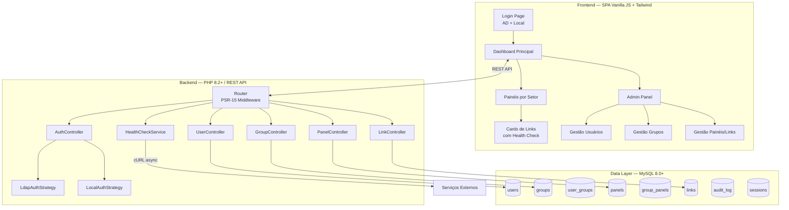
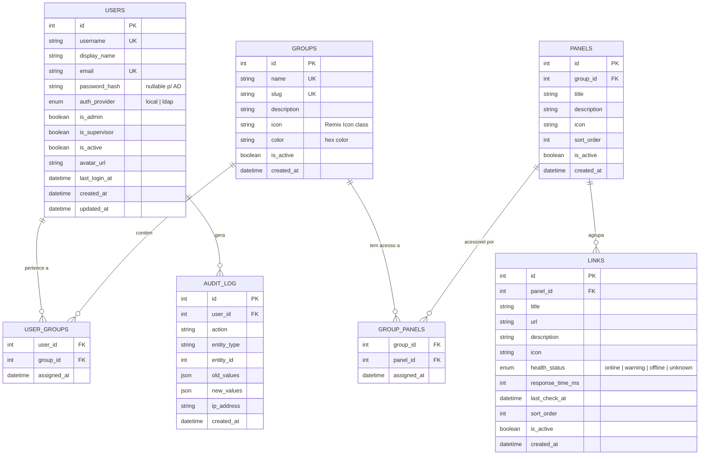

# 🚀 Intranet Flowti — Portal Unificado Corporativo

Construção completa de um portal intranet corporativo robusto e escalável para centralizar todas as aplicações da empresa num único ponto de acesso. Backend em **PHP 8.2+** com MySQL, frontend em **Vanilla JS + Tailwind CSS**, modelo de permissões **RBAC N:N**, autenticação híbrida **LDAP/AD + Local**, e design system **VEM** com tema dark nativo.

---

## User Review Required

> [!IMPORTANT]
> **Autenticação LDAP/AD**: Para integrar com Active Directory, precisarei das seguintes informações quando formos configurar:
> - Host/IP do servidor LDAP
> - Base DN (ex.: `dc=flowti,dc=com,dc=br`)
> - Conta de serviço (bind DN) para leitura do AD
> - Grupo(s) padrão de importação
>
> Por enquanto, a implementação incluirá toda a estrutura LDAP funcional, mas com valores de configuração em `.env` para serem preenchidos depois.

> [!WARNING]
> **Banco MySQL**: Certifique-se de ter acesso a um servidor MySQL 8.0+ ou MariaDB 10.6+ acessível localmente ou na rede. A aplicação usará PDO com charset `utf8mb4`.

---

## Open Questions

> [!IMPORTANT]
> **1. Nome do domínio interno**: Qual será o domínio de acesso do portal? (ex.: `intranet.flowti.com.br`, `portal.flowti.local`)? Isso impacta configuração de Ingress e CORS.

> [!IMPORTANT]
> **2. Porta de desenvolvimento local**: Deseja que o servidor PHP rode na porta `8080` por padrão durante o desenvolvimento?

> [!NOTE]
> **3. Importação de usuários existentes**: Você já tem uma lista de usuários/setores para importar? O sistema suportará importação via CSV desde o primeiro release.

---

## Arquitetura de Alto Nível



---

## Modelo de Dados (RBAC N:N)



---

## Proposed Changes

### 1. Estrutura de Diretórios do Projeto

```
intranet/
├── aplicação/                       # ← Código-fonte da aplicação
│   ├── public/                      # ← Document Root (Apache/Nginx)
│   │   ├── index.html               # ← SPA Entry Point
│   │   ├── assets/
│   │   │   ├── css/
│   │   │   │   └── app.css          # ← Tailwind compilado + custom styles
│   │   │   ├── js/
│   │   │   │   ├── app.js           # ← Orquestrador principal da SPA
│   │   │   │   ├── router.js        # ← Client-side router
│   │   │   │   ├── api.js           # ← Fetch wrapper (interceptors, auth)
│   │   │   │   ├── state.js         # ← Estado global reativo
│   │   │   │   └── components/      # ← Componentes UI modulares
│   │   │   │       ├── Sidebar.js
│   │   │   │       ├── Topbar.js
│   │   │   │       ├── Dashboard.js
│   │   │   │       ├── PanelGrid.js
│   │   │   │       ├── LinkCard.js
│   │   │   │       ├── LoginForm.js
│   │   │   │       ├── UserManager.js
│   │   │   │       ├── GroupManager.js
│   │   │   │       ├── Modal.js
│   │   │   │       └── Toast.js
│   │   │   └── img/                 # ← Logo, favicon, assets visuais
│   │   └── .htaccess                # ← Rewrite para SPA + API proxy
│   │
│   ├── src/                         # ← Backend PHP (PSR-4 Autoload)
│   │   ├── bootstrap.php            # ← Boot: env, DB, session, autoload
│   │   ├── routes.php               # ← Definição de rotas REST
│   │   ├── Config/
│   │   │   ├── Database.php         # ← Singleton PDO
│   │   │   ├── Env.php              # ← Parser de .env
│   │   │   └── Ldap.php             # ← Configuração LDAP
│   │   ├── Middleware/
│   │   │   ├── AuthMiddleware.php   # ← Valida sessão ativa
│   │   │   ├── AdminMiddleware.php  # ← Valida is_admin
│   │   │   ├── SupervisorMiddleware.php
│   │   │   └── CorsMiddleware.php
│   │   ├── Controllers/
│   │   │   ├── AuthController.php   # ← Login/Logout (AD + Local)
│   │   │   ├── UserController.php   # ← CRUD usuários + import CSV
│   │   │   ├── GroupController.php  # ← CRUD grupos
│   │   │   ├── PanelController.php  # ← CRUD painéis
│   │   │   ├── LinkController.php   # ← CRUD links
│   │   │   └── HealthController.php # ← Health check de links
│   │   ├── Services/
│   │   │   ├── AuthService.php      # ← Strategy: LDAP ou Local
│   │   │   ├── LdapAuthStrategy.php # ← Bind LDAP/AD
│   │   │   ├── LocalAuthStrategy.php# ← Bcrypt/Argon2id
│   │   │   ├── UserService.php
│   │   │   ├── GroupService.php
│   │   │   ├── PanelService.php
│   │   │   ├── LinkService.php
│   │   │   └── HealthCheckService.php # ← cURL multi async
│   │   ├── Repositories/
│   │   │   ├── UserRepository.php
│   │   │   ├── GroupRepository.php
│   │   │   ├── PanelRepository.php
│   │   │   └── LinkRepository.php
│   │   └── Helpers/
│   │       ├── Response.php         # ← JSON response padronizado
│   │       └── Validator.php        # ← Validação de inputs
│   │
│   ├── composer.json                # ← PSR-4 autoload + deps
│   ├── .env.example                 # ← Variáveis de ambiente template
│   └── .env                         # ← Configuração local (git-ignored)
│
├── database/
│   ├── schema.sql                   # ← DDL completo do banco
│   └── seed.sql                     # ← Dados iniciais (admin, grupos demo)
│
├── docker/
│   ├── Dockerfile                   # ← PHP 8.2 + Apache + extensões
│   ├── docker-compose.yml           # ← App + MySQL + phpMyAdmin
│   └── nginx.conf                   # ← Config alternativa NGINX
│
├── agents/                          # ← (existente) Definições de agentes
├── .agents/                         # ← (existente) Regras do workspace
├── Documentações/                   # ← Docs arquiteturais e ADRs
│   └── ADR-001-stack-php-mysql.md
│
├── id-visual/
│   └── tokens.json                  # ← Design tokens VEM
│
└── README.md
```

---

### 2. Backend PHP — Camada por Camada

#### [NEW] [composer.json](file:///home/jairo/Documentos/intranet/aplicação/composer.json)
- Autoload PSR-4: `App\\` → `src/`
- Dependência: `vlucas/phpdotenv` para gerenciamento de `.env`

#### [NEW] [.env.example](file:///home/jairo/Documentos/intranet/aplicação/.env.example)
```env
# Database
DB_HOST=127.0.0.1
DB_PORT=3306
DB_NAME=intranet_flowti
DB_USER=root
DB_PASS=

# LDAP / Active Directory
LDAP_ENABLED=false
LDAP_HOST=ldap://ad.flowti.local
LDAP_PORT=389
LDAP_BASE_DN=dc=flowti,dc=com,dc=br
LDAP_BIND_DN=cn=svc-intranet,ou=Service Accounts,dc=flowti,dc=com,dc=br
LDAP_BIND_PASS=
LDAP_SEARCH_FILTER=(sAMAccountName={username})
LDAP_DEFAULT_GROUP=Colaboradores

# App
APP_NAME=Intranet Flowti
APP_ENV=development
APP_SECRET=change-me-to-a-random-string
SESSION_LIFETIME=7200
```

#### [NEW] [bootstrap.php](file:///home/jairo/Documentos/intranet/aplicação/src/bootstrap.php)
- Carrega `.env`, configura PDO singleton, inicia sessão segura, registra autoloader PSR-4

#### [NEW] [routes.php](file:///home/jairo/Documentos/intranet/aplicação/src/routes.php)
Endpoints REST organizados:

| Método | Rota | Middleware | Descrição |
|--------|------|-----------|-----------|
| `POST` | `/api/auth/login` | — | Login (LDAP ou Local) |
| `POST` | `/api/auth/logout` | Auth | Logout |
| `GET` | `/api/auth/me` | Auth | Dados do usuário logado |
| `GET` | `/api/users` | Auth + Admin | Listar usuários |
| `POST` | `/api/users` | Auth + Admin | Criar usuário |
| `PUT` | `/api/users/{id}` | Auth + Admin | Editar usuário |
| `DELETE` | `/api/users/{id}` | Auth + Admin | Desativar usuário |
| `POST` | `/api/users/import-csv` | Auth + Admin | Importar via CSV |
| `GET` | `/api/groups` | Auth | Listar grupos |
| `POST` | `/api/groups` | Auth + Admin | Criar grupo |
| `PUT` | `/api/groups/{id}` | Auth + Admin | Editar grupo |
| `DELETE` | `/api/groups/{id}` | Auth + Admin | Remover grupo |
| `GET` | `/api/panels` | Auth | Painéis do usuário (RBAC filtered) |
| `POST` | `/api/panels` | Auth + Supervisor | Criar painel |
| `PUT` | `/api/panels/{id}` | Auth + Supervisor | Editar painel |
| `DELETE` | `/api/panels/{id}` | Auth + Supervisor | Remover painel |
| `GET` | `/api/links` | Auth | Links por painel |
| `POST` | `/api/links` | Auth + Supervisor | Criar link |
| `PUT` | `/api/links/{id}` | Auth + Supervisor | Editar link |
| `DELETE` | `/api/links/{id}` | Auth + Supervisor | Remover link |
| `POST` | `/api/health/check` | Auth | Checar saúde de links |

#### [NEW] Controllers, Services, Repositories
- **AuthController** com **Strategy Pattern**: `LdapAuthStrategy` e `LocalAuthStrategy` intercambiáveis
- **Prepared Statements** obrigatórios via PDO em todos os Repositories
- **Response Helper** padronizado: `{ "success": bool, "data": {}, "message": "string" }`
- **Password hashing** com `PASSWORD_ARGON2ID`
- **Audit Log** automático em todas as operações de mutação

---

### 3. Frontend — SPA Vanilla JS + Tailwind + Design System VEM

#### [NEW] [index.html](file:///home/jairo/Documentos/intranet/aplicação/public/index.html)
- Entry point da SPA, carrega Google Fonts (Poppins), Remix Icons, Tailwind CDN, e os módulos JS

#### [NEW] [app.js](file:///home/jairo/Documentos/intranet/aplicação/public/assets/js/app.js)
- Orquestrador principal: inicializa router, carrega estado, renderiza layout

#### Componentes visuais planejados:

| Componente | Descrição | Interatividade |
|-----------|-----------|----------------|
| **LoginForm** | Tela de login com toggle AD/Local, animações de entrada | Shake animation em erro, loading spinner |
| **Sidebar** | Menu lateral colapsável com ícones Remix | Expand/collapse animado, active state highlight |
| **Topbar** | Header com avatar, busca global, notificações | Dropdown de perfil, search com debounce |
| **Dashboard** | Grid de cards com métricas rápidas | Contadores animados, sparkline charts |
| **PanelGrid** | Grid responsivo de painéis do setor | Hover scale, glassmorphism cards |
| **LinkCard** | Card individual do link com health status | Badge pulsante (online/offline), tooltip de latência |
| **UserManager** | Tabela de usuários com filtros e ações | Modal de criação/edição, import CSV com drag-n-drop |
| **GroupManager** | Gestão de grupos/setores | Associação de usuários via multi-select |
| **Modal** | Modal genérico reutilizável | Backdrop blur, slide-in animation |
| **Toast** | Notificações toast | Auto-dismiss, stack animation |

#### Design System VEM Aplicado:
- **Dark Mode nativo** como padrão (`#111827` background)
- **Cores primárias**: VEM Blue `#0165aa`, VEM Orange `#f67f1d`
- **Glassmorphism** em cards: `backdrop-blur-xl bg-white/5 border border-white/10`
- **Transições suaves**: `transition-all duration-200 ease-in-out` em todos os interativos
- **Health Check visual**: badges pulsantes com cores semânticas (🟢🟡🔴)

---

### 4. Infraestrutura Docker

#### [NEW] [Dockerfile](file:///home/jairo/Documentos/intranet/docker/Dockerfile)
- Base: `php:8.2-apache`
- Extensões: `pdo_mysql`, `ldap`, `mbstring`, `curl`, `json`
- Apache mod_rewrite habilitado
- Composer instalado

#### [NEW] [docker-compose.yml](file:///home/jairo/Documentos/intranet/docker/docker-compose.yml)
```yaml
services:
  app:
    build: .
    ports: ["8080:80"]
    volumes: ["../aplicação:/var/www/html"]
    depends_on: [mysql]
    env_file: ../aplicação/.env

  mysql:
    image: mysql:8.0
    ports: ["3306:3306"]
    environment:
      MYSQL_ROOT_PASSWORD: rootpass
      MYSQL_DATABASE: intranet_flowti
    volumes: ["mysql_data:/var/lib/mysql", "../database/schema.sql:/docker-entrypoint-initdb.d/01-schema.sql", "../database/seed.sql:/docker-entrypoint-initdb.d/02-seed.sql"]

  phpmyadmin:
    image: phpmyadmin/phpmyadmin
    ports: ["8081:80"]
    environment:
      PMA_HOST: mysql
```

---

### 5. Database Schema & Seed

#### [NEW] [schema.sql](file:///home/jairo/Documentos/intranet/database/schema.sql)
- DDL completo para todas as tabelas do modelo ER acima
- Índices compostos em tabelas de junção
- Foreign Keys com `ON DELETE CASCADE` onde apropriado
- Charset `utf8mb4_unicode_ci`

#### [NEW] [seed.sql](file:///home/jairo/Documentos/intranet/database/seed.sql)
- Usuário admin padrão: `admin` / `Admin@Flowti2024`
- Grupos demo: TIC, Financeiro, Recursos Humanos, Diretoria
- Painéis e links de exemplo com URLs reais (Grafana, GitLab, etc.)

---

### 6. Documentação

#### [NEW] [README.md](file:///home/jairo/Documentos/intranet/README.md)
- Visão geral, requisitos, setup rápido com Docker, configuração LDAP

#### [NEW] [ADR-001-stack-php-mysql.md](file:///home/jairo/Documentos/intranet/Documentações/ADR-001-stack-php-mysql.md)
- Registro da decisão arquitetural: PHP + MySQL + Vanilla JS

#### [NEW] [tokens.json](file:///home/jairo/Documentos/intranet/id-visual/tokens.json)
- Design tokens VEM em formato JSON consumível

---

## Funcionalidades Destaque (para impressionar o gerente 😎)

### 🎯 Health Check em Tempo Real
- Backend faz `curl_multi_exec` assíncrono em todos os links cadastrados
- Timeout estrito de 2000ms com `AbortController`
- Dashboard mostra badges pulsantes: 🟢 Online | 🟡 Lento (>1000ms) | 🔴 Offline
- Atualização periódica via polling (configurável)

### 🔐 Autenticação Inteligente
- Tela de login com toggle visual entre AD e Local
- Primeira tentativa via LDAP (se habilitado), fallback para local
- Importação automática de atributos do AD (nome, email, departamento)
- Auto-provisionamento: usuário do AD é criado localmente no primeiro login

### 📊 Dashboard com Métricas Executivas
- Total de aplicações monitoradas
- Uptime percentual dos sistemas
- Usuários ativos nas últimas 24h
- Links com problemas (atenção + offline)
- Gráficos sparkline com tendência

### 🎨 UI Premium com Micro-animações
- Cards com hover scale + glassmorphism
- Sidebar com expand/collapse suave
- Toast notifications empilháveis
- Skeleton loading em todos os dados assíncronos
- Transições de página com fade
- Search com highlight animado nos resultados

---

## Verification Plan

### Automated Tests
```bash
# Backend — testes unitários PHP
cd aplicação && composer test

# Health check do banco
curl -s http://localhost:8080/api/health/check | jq

# Validação de RBAC — tentativa de acesso não autorizado
curl -s -X GET http://localhost:8080/api/users -H "Cookie: PHPSESSID=invalid" | jq '.success' # esperado: false
```

### Manual Verification
1. **Docker Compose up** — verificar se todos os containers sobem saudáveis
2. **Login Local** — criar sessão com admin/Admin@Flowti2024
3. **Login LDAP** — testar bind com credenciais AD (quando configurado)
4. **Dashboard** — verificar renderização de cards, métricas e health check
5. **RBAC** — verificar que Colaborador não vê menu Admin, Supervisor não gerencia usuários
6. **Responsividade** — testar em resoluções desktop (1920px) e tablet (768px)
7. **Health Check** — verificar badges de status e polling automático

